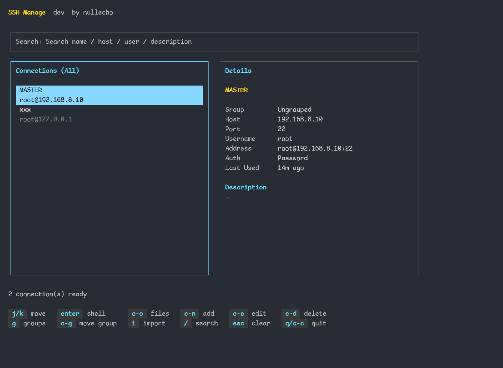
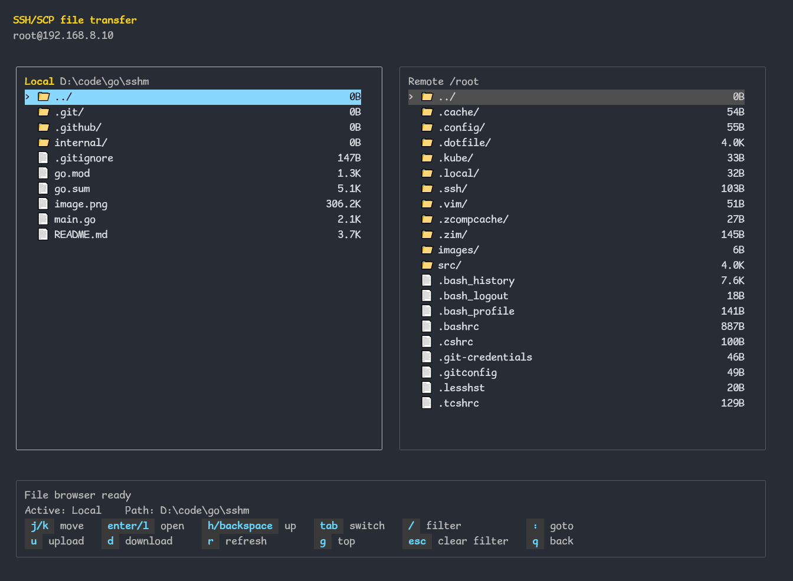

# sshm

`sshm` 是一个基于 Go 与 Bubble Tea 的终端 SSH 工作台，用于集中管理 SSH 连接、打开远端 Shell，并在本地与远端之间传输文件。




## 特性

- 终端 TUI：连接列表、详情面板、实时搜索过滤、快捷键帮助、命令面板
- 连接管理：新增、编辑、删除、最近使用排序
- 分组管理：按分组筛选连接、移动连接到分组、新建 / 重命名 / 删除分组
- 导入能力：从 OpenSSH `ssh_config` 导入连接，并支持通过注释指定分组
- 认证方式：密码认证、私钥认证
- 远端访问：从主界面直接进入交互式 SSH Shell
- 文件工作区：本地 / 远端双栏浏览、实时过滤、路径跳转、上传、下载、覆盖确认、进度显示
- 无头模式：支持 `ls`、`run`、`upload`、`download`、`version`
- 本地安全：SQLite 持久化、密码加密存储、`known_hosts` 指纹记录
- 国际化：支持 `en` 与 `zh-CN`

## 环境要求

- Go `1.23+`
- 可交互终端环境
- 可访问的 SSH 目标主机
- 无需额外 C 编译工具链

## 快速开始

```bash
go build ./...
go run .
```

无参数启动进入 TUI。

## 无头模式

```bash
sshm ls
sshm ls --group 生产 --filter web
sshm run -n prod -- "uname -a"
sshm run -n prod,web --file ./deploy.sh
sshm upload -n prod -l ./dist -r /tmp/
sshm download -n prod -r /var/log/app.log -l ./logs/
sshm version
```

说明：

- `ls`：列出连接，可按分组或关键字过滤
- `run`：执行远端命令或脚本，支持批量目标
- `upload`：上传本地文件或目录到远端，支持批量目标
- `download`：下载远端文件或目录到本地，仅支持单目标
- `version`：输出当前构建版本
- 默认目标已存在即失败，添加 `-f` / `--force` 可覆盖
- 批量 `run` / `upload` 可用 `--fail-fast` 在首个失败时停止
- `--group ungrouped` 可过滤未分组连接

## TUI 快捷键

### 主界面

| 按键 | 说明 |
| --- | --- |
| `j` / `k` | 移动选中项 |
| `:` / `c-p` | 打开命令面板 |
| `/` | 搜索 |
| `esc` | 退出搜索、清空搜索或清空分组过滤 |
| `enter` | 打开远端 Shell |
| `c-o` | 打开文件工作区 |
| `c-n` | 新建连接 |
| `c-e` | 编辑连接 |
| `c-d` | 删除连接 |
| `g` | 打开分组面板并筛选连接 |
| `c-g` | 打开分组面板并移动选中连接到分组 |
| `i` | 导入 `ssh_config` |
| `?` | 查看帮助 |
| `q` / `c-c` | 退出 |

### 分组面板

| 按键 | 说明 |
| --- | --- |
| `j` / `k` | 移动 |
| `enter` | 选择分组或确认移动 |
| `a` | 新建分组 |
| `r` | 重命名分组 |
| `d` | 删除分组 |
| `esc` | 先退出当前内层状态；无内层状态时关闭面板 |
| `q` | 关闭分组面板 |

说明：

- 删除分组确认态下：`enter / y` 确认，`esc / n` 取消，`q` 关闭整个分组面板

### 文件工作区

| 按键 | 说明 |
| --- | --- |
| `tab` | 切换本地 / 远端面板 |
| `j` / `k` | 移动 |
| `c-p` | 打开命令面板 |
| `enter` / `l` / `→` | 进入目录 |
| `h` / `backspace` / `←` | 返回上级 |
| `/` | 过滤当前面板 |
| `:` | 跳转路径 |
| `c-u` | 上传当前本地文件 / 目录 |
| `c-s` | 下载当前远端文件 / 目录 |
| `c-n` | 在当前面板新建目录 |
| `c-r` | 重命名当前选中文件 / 目录 |
| `c-d` | 删除当前选中文件 / 目录 |
| `r` | 刷新 |
| `g` | 跳到顶部 |
| `esc` | 先退出当前内层状态；普通态下清空当前面板过滤条件 |
| `q` | 返回主界面 |

说明：

- 覆盖确认态下：`← / →` 选择，`enter / y` 确认，`esc / n` 取消
- 上传只能在本地面板触发，下载只能在远端面板触发
- 文件工作区中的新建 / 重命名 / 删除统一为 `c-n` / `c-r` / `c-d`
- 下载改为 `c-s`，避免与删除冲突
- 过滤输入为实时生效；路径发生变化时会自动清除当前面板过滤条件

### 导入面板

| 按键 | 说明 |
| --- | --- |
| `enter` / `c-s` | 预览或执行导入 |
| `j` / `k` | 移动 |
| `space` | 切换导入动作 |
| `esc` | 退出导入 |

## 配置与数据目录

首次启动会自动创建配置目录：

```text
Linux:   ~/.config/sshm/ 或 $XDG_CONFIG_HOME/sshm/
Windows: %AppData%\sshm\
macOS:   ~/Library/Application Support/sshm/
```

默认生成：

- `config.toml`
- `data/sshm.db`
- `app.key`
- `known_hosts`

默认配置：

```toml
[app]
language = "en"
theme = "dark"

[storage]
database_path = "data/sshm.db"

[ssh]
default_private_key_path = "~/.ssh/id_rsa"
```

`theme` 当前支持：

- `dark`：默认主题，适合深色终端
- `dracula`：高对比暗色主题，强调色更鲜明
- `light`：适合亮色终端
- `nord`：冷静低饱和暗色主题，适合长时间使用

## 导入 `ssh_config`

支持读取 OpenSSH `Host` 配置，并支持通过注释为后续 Host 指定分组：

```sshconfig
# sshm:group=生产环境
Host prod-web
  HostName 10.0.0.1
  User deploy
  Port 2222
  IdentityFile ~/.ssh/id_ed25519
```

## 构建与发版

本地调试构建：

```bash
go build ./...
go test ./...
```

注入版本号的本地构建示例：

```bash
go build -trimpath -ldflags "-X sshm/internal/buildinfo.Version=v0.1.0" .
./sshm version
```

仓库内置 GitHub Actions 发版流程：

- Workflow: `.github/workflows/release.yml`
- 输入 `version`：必须包含 `v` 前缀，例如 `v0.1.0`
- 输入 `git_ref`：默认 `master`
- 当前产物：
  - `linux-amd64`
  - `darwin-amd64`
  - `darwin-arm64`
  - `windows-amd64`

## 已知限制

- 当前文件工作区暂不提供独立“移动”入口
- `download` 无头模式不支持多目标
- 文件传输更适合类 Unix 远端环境

## 安全说明

- 不要提交 `sshm.db`、日志、`app.key`、`known_hosts` 或本地配置
- SSH 凭据、主机名、加密后的密码数据都应视为敏感信息

## 开发

```bash
gofmt -w <files>
go test ./...
go build ./...
```

## 给 AI 使用的 CLI 调用模板

下面这段内容可以直接复制给 AI，作为调用 `sshm` CLI 的约束和操作说明：

```text
你现在要通过 sshm 的 CLI 模式操作 SSH 连接。

目标：
- 使用 sshm 完成连接查询、远端命令执行、上传、下载。
- 不要启动 TUI，不要进入交互界面。

执行规则：
- 只使用这些命令：`sshm ls`、`sshm run`、`sshm upload`、`sshm download`、`sshm version`
- 如果任务涉及具体连接，先执行 `sshm ls`，必要时配合 `--group` 或 `--filter` 缩小范围
- 连接名必须使用 `sshm ls` 输出中的精确名称，不要猜测
- 执行远端命令时，必须使用 `--` 作为分隔符，格式为：`sshm run -n <连接名> -- <远端命令>`
- 执行多行脚本时，不要把长脚本直接拼进命令；应先写入本地脚本文件，再用：`sshm run -n <连接名> --file <脚本文件>`
- 多个连接使用英文逗号拼接，例如：`-n prod-api,prod-job`
- `upload` 的 `--remote` 表示远端目录，不是最终文件完整路径；上传时会保留本地文件或目录名
- `download` 的 `--local` 表示本地目录，不是最终文件完整路径；下载时会保留远端文件或目录名
- `download` 只允许单个连接名，不支持批量下载
- 默认情况下，如果上传或下载目标已存在，会直接失败；只有明确需要覆盖时才添加 `-f` 或 `--force`
- 批量 `run` / `upload` 如需首个失败立即停止，可加 `--fail-fast`
- 以退出码判断结果：`0` 表示成功，`1` 表示失败
- 优先保留原始命令输出，不要擅自改写远端返回内容

命令模板：
- 列出全部连接：`sshm ls`
- 按分组过滤：`sshm ls --group <分组名>`
- 按关键字过滤：`sshm ls --filter <关键字>`
- 查看未分组连接：`sshm ls --group ungrouped`
- 单连接执行命令：`sshm run -n <连接名> -- <命令>`
- 多连接批量执行：`sshm run -n <连接1,连接2> -- <命令>`
- 执行本地脚本：`sshm run -n <连接名> --file <脚本文件>`
- 上传文件或目录：`sshm upload -n <连接名> --local <本地文件或目录> --remote <远端目录>`
- 强制上传覆盖：`sshm upload -n <连接名> --local <本地文件或目录> --remote <远端目录> -f`
- 下载文件或目录：`sshm download -n <连接名> --remote <远端文件或目录> --local <本地目录>`
- 强制下载覆盖：`sshm download -n <连接名> --remote <远端文件或目录> --local <本地目录> -f`
- 查看版本：`sshm version`

推荐流程：
1. 先用 `sshm ls` 确认连接名
2. 再执行 `run` / `upload` / `download`
3. 如果失败，优先保留 stderr 原文，并根据报错调整参数

常见错误避免：
- 不要写成 `sshm <连接名> -- <命令>`，这是无效的，必须显式使用 `run`
- 不要省略 `run` 后面的 `--`
- 不要对 `download` 传多个连接名
- 不要把 `upload --remote` 写成远端最终文件名路径后再假设会重命名；当前行为是拼接本地名称
- 不要在未确认需要覆盖时默认加 `-f`

如果要把这套能力封装成 skill，可直接把以上规则作为“CLI 调用约束”放入 skill 提示词。
```
