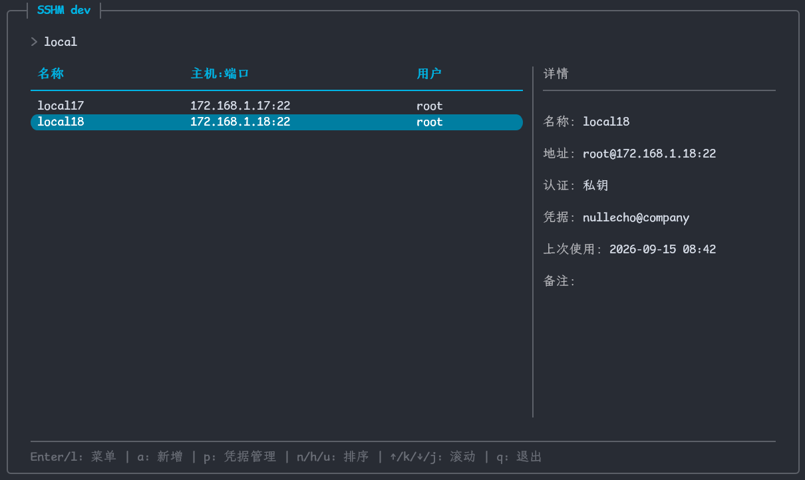

# SSHM

一个运行在终端中的 SSH 连接管理器，使用 Go 编写。它可以集中保存 SSH 连接和登录凭据，在终端内快速进入交互式 Shell，或使用双栏界面进行本地与远程文件传输。



## 功能

- 终端交互式 SSH 连接管理
- 支持密码和 SSH 私钥两种登录凭据
- 连接信息、凭据的新增、编辑、删除和搜索
- 主密码保护本地数据库
- 凭据内容加密保存
- 记录连接使用次数和最近使用时间
- 基于 `known_hosts` 校验远程主机公钥
- 双栏 SFTP 文件管理
  - 本地/远程目录浏览
  - 文件和目录上传、下载、远程复制
  - 多选、复制粘贴、删除、重命名、新建文件夹
  - 按名称、大小、修改时间排序
  - 搜索、路径跳转、进度显示和任务取消
- 支持 Windows、Linux、macOS 等 Go 支持的平台

## 环境要求

- Go 1.25 或更高版本
- 可用的终端环境（建议至少 `80×20`）
- 目标 SSH 服务已启用密码或公钥认证

## 安装与运行

直接运行：

```bash
go run .
```

构建可执行文件：

```bash
go build -o sshm .
./sshm
```

Windows PowerShell：

```powershell
go build -o sshm.exe .
.\sshm.exe
```

首次启动时需要设置主密码；之后每次启动输入主密码即可解锁数据库。

## 基本操作

### 主界面

| 按键 | 操作 |
| --- | --- |
| `↑/k`、`↓/j` | 移动连接 |
| `Enter` / `l` | 打开连接菜单 |
| `a` | 新增连接 |
| `p` | 凭据管理 |
| `/` | 搜索连接 |
| `n` / `h` / `u` | 按名称 / 主机 / 用户排序，再次按下可切换顺序 |
| `q` | 退出 |

连接菜单中可以选择：

- 连接 Shell
- 打开文件传输
- 编辑连接
- 删除连接

### 文件传输

| 按键 | 操作 |
| --- | --- |
| `1` / `2` | 切换本地 / 远程面板 |
| `↑/k`、`↓/j` | 移动 |
| `h` / `Backspace` | 返回上级目录 |
| `l` / `Enter` | 进入目录 |
| `Space` | 多选 |
| `y` / `p` | 复制 / 粘贴 |
| `d` | 删除 |
| `r` | 重命名 |
| `a` | 新建文件夹 |
| `/` | 搜索当前目录 |
| `Ctrl+G` | 跳转到路径 |
| `n` / `s` / `t` | 按名称 / 大小 / 修改时间排序 |
| `?` | 打开帮助 |
| `q` / `Esc` | 关闭文件传输 |


## 数据库与记住密码

默认数据库文件名为 `sshm.db`。程序会按以下顺序查找数据库：

1. 可执行文件所在目录
2. 用户配置目录下的 `sshm/sshm.db`

可以使用 `SSHM_DB_PATH` 指定数据库文件或数据库目录：

```bash
SSHM_DB_PATH=/path/to/sshm.db ./sshm
```

解锁时按 `Ctrl+S` 可以记住应用密码。以后启动时将自动解锁。文件损坏或应用密码修改后，程序会提示重新输入。

## 安全说明

- 凭据不会以明文写入数据库，数据库由主密码解锁。
- 记住密码不保存明文密码，该功能用于避免密码直接暴露，不能抵抗已取得本机文件读取权限的恶意程序。
- SSH 连接使用用户目录下的 `~/.ssh/known_hosts`。
- 首次连接时记录主机公钥；后续公钥不匹配会拒绝连接。
- SSH 或 SFTP 会话结束后，程序会清理内存中的凭据数据。
- 请妥善保管主密码；项目不提供找回或绕过主密码的机制。

## 开发与测试

```bash
go test ./...
```

代码主要分为以下模块：

- `internal/app`：应用启动和数据库路径
- `internal/repository`：SQLite 数据库、凭据加密和数据访问
- `internal/ssh`：SSH Shell、SFTP 和文件传输
- `internal/tui`：终端用户界面
